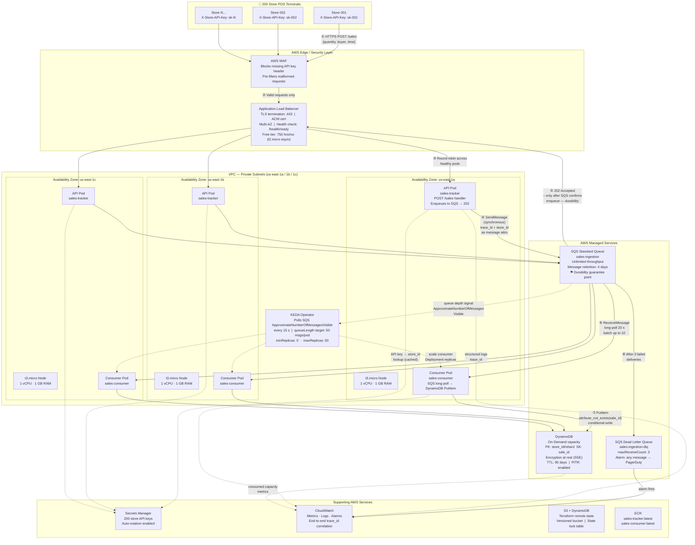
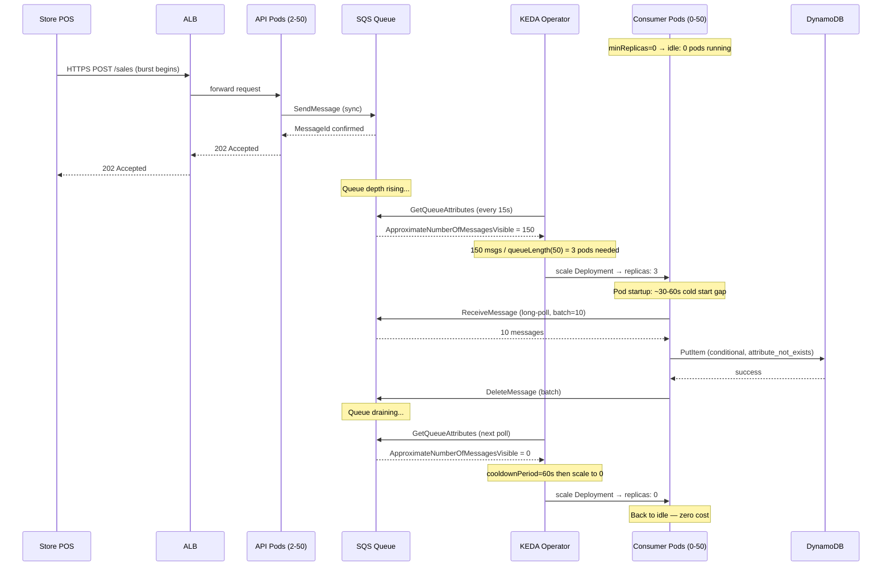
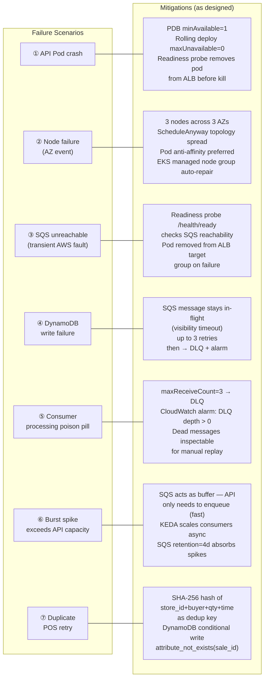
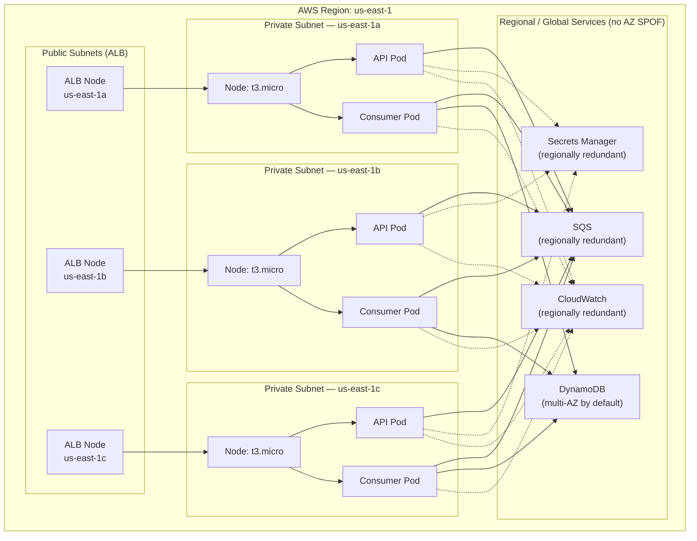

# Sales Tracker — System Architecture Diagrams

## Diagram 1: Complete Request Flow with Multi-AZ Boundaries



---

## Diagram 2: KEDA Autoscaling Trigger Sequence



---

## Diagram 3: Failure Scenarios and Mitigations



---

## Diagram 4: Multi-AZ Topology and SPOF Elimination



---

## Key Design Decisions at a Glance

| Layer | Component | Why chosen | Free tier limit |
|-------|-----------|------------|-----------------|
| Edge | ALB | Multi-AZ, health checks, TLS termination | 750 hrs/mo |
| Compute | EKS on t3.micro | Managed K8s, IRSA, auto-repair | 3 nodes = 3 × 750 hrs/mo |
| Buffer | SQS Standard | Unlimited throughput, 4-day retention | 1M requests/mo free |
| Scaling | KEDA on SQS depth | Right signal for I/O-bound consumer | Open source, no cost |
| Storage | DynamoDB on-demand | Serverless scale, SSE, PITR | 25 GB + 25 WCU free |
| Auth | Secrets Manager | Per-store rotation, IRSA integration | $0.40/secret/mo |
| Observability | CloudWatch | Native AWS, trace_id correlation | 10 custom metrics free |
| IaC state | S3 + DynamoDB | Versioned, locked, no SPOF | S3 5 GB free |

## Durability Guarantee Point

```
POST /sales received
        │
        ▼
   Validate payload
   Extract store_id from API key
   Compute SHA-256 dedup hash
        │
        ▼
   SQS SendMessage ◄─── 202 Accepted sent ONLY after this confirms
        │                    (SQS is the durability boundary)
        ▼
   Consumer polls asynchronously
        │
        ▼
   DynamoDB PutItem (conditional)
        │
        ├── Success → DeleteMessage from SQS
        ├── ConditionalCheckFailed (duplicate) → DeleteMessage (idempotent)
        └── Other error → Leave in-flight → retry → DLQ after 3 attempts
```
